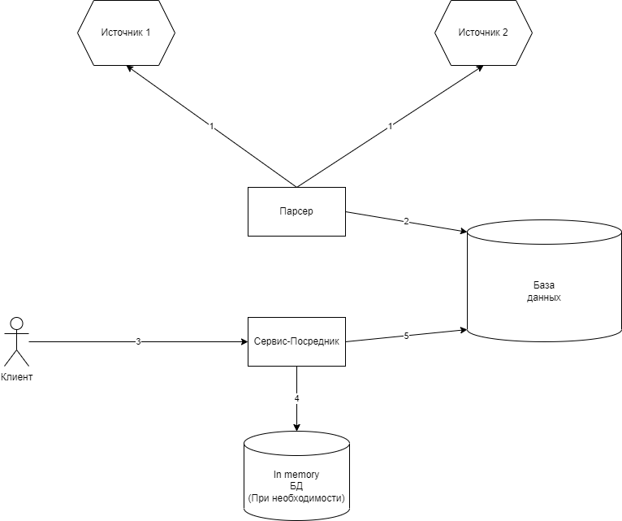
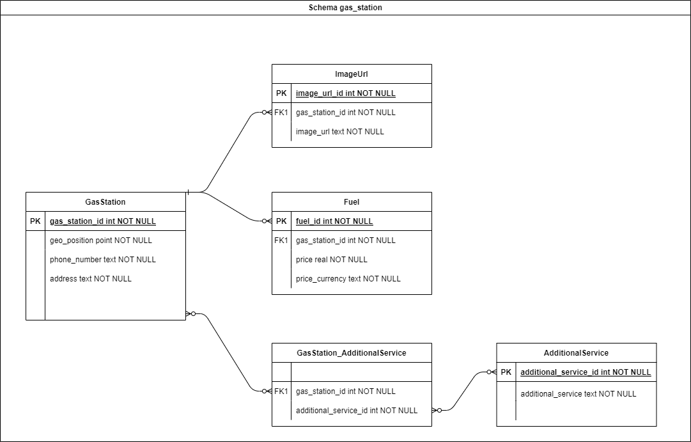

# Задание 3

## Требуется

1. Описать схему API для Сервера-посредника для взаимодействия с Клиентами.
2. Описать
    * Общую схему работы Сервера-посредника
    * Взаимодействие с Источниками и Клиентами
    * Составить примерный список необходимых для реализации инструментов и библиотек.

## Вопросы, которые бы я задал бизнес-аналитику

1. Почему два важных действия(Parser/API) делает один сервис?  
   Я бы разделил на два, т.к. логика парсера выглядит достаточно нагруженной.   
   Думаю, я бы не хотел делать монолитное приложение в данном случае.
2. Наверное, в ответах от API "Источника 1" и "Источника 2" должны быть даты последнего изменения?  
   Иначе не совсем понятно в каких случаях нам нужно обновлять данные в БД, а в каких нет.
3. В каком формате из источников приходят данные?

## Решение

### 1.1 Описать схему API для Сервера-посредника для взаимодействия с Клиентами.

#### Перед описанием схемы определимся с целями, для которых создаем API.

Так как из требований выделить цели не удается, опишу стандартный набор API endpoint-ов.  

Будем считать, что цель у нас покрыть набор endpoint-ов для мобильного приложения и для просмотра некоторой статистики

* api/v1/
    * `[GET] gas-station/{id} ` 
      - Возвращает все данные о заправочной станции
    * `[GET] gas-station/near/?latitude=1&longitude=1` 
      - Возвращает ближайшую АЗС к заданным координатам
    * `[GET] gas-station/?city=city ` 
      - Возвращает АЗС из одного города
    * `[GET] gas-station/?region=region ` 
      - Возвращает АЗС из одного региона
    * `[GET] gas-stations/info ` 
      - Возвращает сводную информацию по всем точкам
    * `[GET] gas-station/?latitude=1&longitude=1&zoom=1000` 
      - Возвращает АЗС из квадрата с центральной точкой latitude/longitude и шириной экрана в zoom
    * `[GET] gas-station/{id}/fuels `
      - Возвращает данные о всех видах топлива на АЗС
    * `[GET] gas-station/{id}/additional-services `
      - Возвращает данные о дополнительных услугах АЗС
    * `[GET] gas-station/{id}/image-urls `
      - Возвращает все ссылки на картинки АЗС
    * `[GET] gas-station/fuel/max-price `
      - Возвращает станцию с максимальной ценой топлива
    * `[GET] gas-station/image-url/max `
      - Вывести АЗС с наибольшим количеством картинок
    * `[GET] fuel/max-price `
      - Возвращает информацию о самом дорогом топливе в базе данных

### 2.1 Описание общей схемы работы Сервера-посредника

В моем понимание должно быть два независимых сервиса. Один из них парсит данные с источников, другой является
сервисом-API  

1. Первый шаг выполняет сервис-парсер. Он загружает данные с источников
2. INSERT/UPDATE данных в БД
3. Далее, при запросе данных клиентом, происходит шаг 4 и/или 5. API-сервис обращается в Cache/DB, при необходимости
   модифицирует/объединяет данные и возвращает их
4. Обращение к Cache
5. Обращение к БД

### 2.2 Взаимодействие с Источниками и Клиентами

#### С источниками

Предполагаю, что источники должны возвращать, дату последнего изменения данных.

1. В таком случае сервис-парсер выступает в роли CronJob-а и обращается к источникам каждую минуту или час, или любое
   другое более подходящее время. После чего сравнивает сохраненную сервисом дату с датой из источника.
2. В случае, изменения даты из источника, требуется приступить к изменению данных в БД.
3. Для изменения данных в БД, в случае, периодических вставок данных, в моем понимание, есть несколько алгоритмов:
    1. TRUNCATE TABLE, после чего вставляем заново все данные и так, каждый раз.  
       (Подходит, когда данные из источника, каждый раз сильно отличаются от сохраненных данных или когда данных не
       очень много)
    2. Последовательная сверка данных и изменение, в случае, их отличия  
       (Подходит, когда данные не сильно отличаются)
4. Если перенести все вышесказанное на наши источники, то я думаю, получится следующие алгоритмы работы.
    * Вариант с последовательной сверкой данных, как я думаю, подходит для "Источника 1", т.к. в нем, скорее всего,
      данные почти не меняются. Будем идти по каждой записи и сверять данные, после чего в случае необходимости делать
      UPDATE.
    * Вариант с TRUNCATE же подходит для вставки данных из "Источника 2", т.к. предполагаю, что данные по ценам на
      топливо меняются очень часто и подход с перепроверкой всех записей может быть слишком накладным.
      Поэтому думаю, что можно пачками за несколько транзакций перезаписать данные.
5. В моем решение присутствует не консистентность данных из источников и в БД на всех этапах.
    * И при проверке раз в определенный промежуток времени и при вставке данных в БД, но, думаю, задача это
      подразумевает
      и время отсутствия консистентности можно уменьшать с помощью различных доработок, требующих более точного описания
      входных данных

#### С клиентами

В контексте работы с клиентами нет никаких требований, поэтому сложно что-либо описать.

* Есть один важный момент. Клиенты могут получать неактуальные данные некоторое не очень большое время, т.к. во-первых,
  данные необходимо запросить с источника и во-вторых, загрузить их в БД.

* Также упомяну про кеширование.  
  Кеширование есть смысл добавлять только в случае необходимости. По данным из требований сложно сказать, есть эта
  необходимость или нет.   
  Кеширование добавляют в случае неравномерности запрашиваемых данных из БД, в данном случае, определить данный момент
  достаточно сложно.

### 2.3 Составить примерный список необходимых для реализации инструментов и библиотек.

* python >= 3.5
* Redis. В случае, если захотим кешировать
* Version_1
    * fastapi
    * fastapi-admin
    * celery - Зависит от того, где мы будем запускать сервис-парсер, если на отдельном сервере, то в celery
      необходимости нет
    * psycopg
    * redis-py
    * pydantic
* Version_2

## Схема БД

